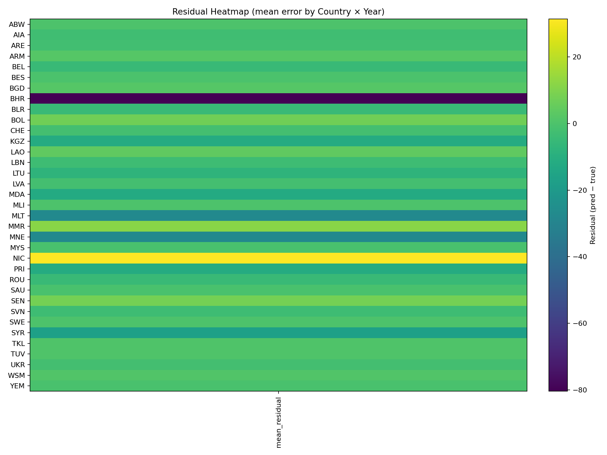

# 🌍 EcoDetect – Forest Share Prediction & Visualization

EcoDetect is a Machine Learning project that predicts and visualizes **forest area share trends** using country-level datasets.  
It trains regression models, generates predictions, and provides easy-to-read graphs such as accuracy curves, prediction histograms, scatter plots, and residual heatmaps.

---

## 📂 Project Structure

Eco Detect/
│
├── archive/
│ └── goal15.forest_shares.csv # Input dataset (from UN SDG Goal 15)
│
├── eco_forest_train.py # Train models, save artifacts
├── eco_forest_show_results.py # Plot training/validation results
├── eco_forest_predict_nb.py # Notebook-friendly prediction module
│
├── eco_forest_rf.pkl # Trained sklearn pipeline (RandomForest)
├── eco_forest_mlp.h5 # Trained Keras model (optional)
├── eco_forest_config.yaml # Saved training config
├── eco_forest_metrics.json # Validation metrics (RMSE, MAE, R²)
├── history.csv # Keras training history (if enabled)
│
├── predictions.csv # Predictions output
├── pred_hist.png # Prediction histogram
├── pred_vs_actual.png # Predicted vs True scatter
├── residual_heatmap.png # Heatmap of residuals by Country × Year
└── accuracy_curve.png # Training accuracy graph (from history.csv)

markdown
Copy code

---

## 🚀 Features

- **Data Cleaning**
  - Handles missing values via interpolation
  - Detects target column (`forest_share`, `trend`, etc.)
  - Detects country/year columns for residual grouping

- **Training (`eco_forest_train.py`)**
  - Scikit-learn **RandomForestRegressor** pipeline → `eco_forest_rf.pkl`
  - Keras **MLP** model → `eco_forest_mlp.h5`
  - Saves metrics in JSON (`RMSE`, `MAE`, `R²`)
  - Saves config in YAML

- **Visualization (`eco_forest_show_results.py`)**
  - Accuracy curve (MAE / RMSE over epochs)
  - Residual heatmap (mean prediction error by Country × Year)
  - Predicted vs Actual scatter

- **Prediction (`eco_forest_predict_nb.py`)**
  - Easy-to-use function `predict_csv()` for Jupyter
  - Saves predictions to CSV
  - Generates plots:
    - Histogram of predictions
    - Predicted vs Actual scatter (if ground truth available)
    - Residual heatmap (if Country/Year available)

---

## 📊 Example Outputs

- **Predictions CSV**
```csv
Country,Year,trend,y_pred
India,2000,21.3,21.8
India,2005,20.9,20.5
Brazil,2010,55.2,54.7
...
Plots

pred_hist.png → distribution of predicted forest shares

pred_vs_actual.png → scatter comparing predictions vs true values

residual_heatmap.png → where the model over/under-predicts across countries and years

accuracy_curve.png → training history of Keras model

⚙️ How to Run
1. Install requirements
bash
Copy code
pip install pandas numpy scikit-learn matplotlib tensorflow joblib pyyaml
2. Train models
bash
Copy code
python eco_forest_train.py
Artifacts will be saved to C:\Users\sagni\Downloads\Eco Detect\.

3. Show training & validation results
bash
Copy code
python eco_forest_show_results.py
Generates plots and metrics summary.

4. Predict in Jupyter
python
Copy code
from eco_forest_predict_nb import predict_csv

pred_path = predict_csv(
    input_csv=r"C:\Users\sagni\Downloads\Eco Detect\archive\goal15.forest_shares.csv",
    out_csv=r"C:\Users\sagni\Downloads\Eco Detect\predictions.csv",
    show_plots=True
)
print("Predictions saved to:", pred_path)

📈 Metrics
Example (from eco_forest_metrics.json):

json
Copy code
{
  "sklearn_rf": {
    "rmse": 0.83,
    "r2": 0.91
  },
  "keras_mlp": {
    "rmse": 1.02,
    "mae": 0.76
  },
  "target_column": "trend"
}
🌟 Extensions
Add time-series forecasting (e.g., LSTM, Prophet) for future forest cover prediction

Integrate with satellite imagery (Sentinel-2, Landsat) for spatial deforestation detection

Build a Streamlit dashboard for interactive visualization
